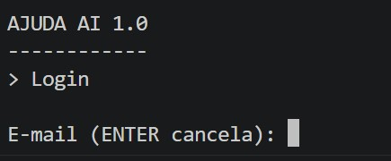
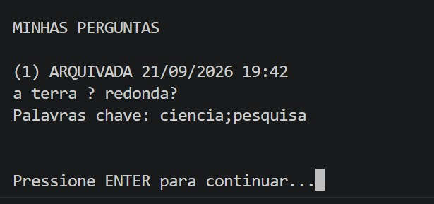

RELATORIO DO TRABALHO PRATICO 1 - AEDS III
SISTEMA: Ajuda Ai 1.0 (Relacionamento 1:N)

PARTICIPANTES:
- Arthur Mendes Lima
- Gabriel Teodoro Gomes
- Jean Carlos Lopes Lellis
- Nicolas Alexandre Torres Dias

## Vídeo de Demonstração

O vídeo demonstrativo com os fluxos operacionais exigidos pelo trabalho está disponível no YouTube:
- **Link do Vídeo:** [Demonstração TP1 - Ajuda Aí 1.0](https://www.youtube.com/watch?v=j-f7jbeCIKs)

1. DESCRICAO DO SISTEMA

O Ajuda Ai 1.0 e um sistema de gestao de forum baseado em terminal que gerencia o ciclo completo de usuarios e perguntas armazenados diretamente em arquivos binarios, sem utilizacao de gerenciadores de banco de dados externos. O foco do projeto e a estruturacao e manipulacao do relacionamento 1:N (um para muitos).

A aplicacao possui uma arquitetura em camadas bem definida: visao (menus em texto via Console), controle/repositorio (regras de negocio e validacoes) e arquivos (persistencia binaria com indices diretos e indiretos). 

Principais recursos:
- Cadastro e login seguro com hash SHA-256 e e-mails unicos indexados.
- Recuperacao de credenciais com normalizacao de texto para a resposta secreta (insensivel a caixa e acentuacao).
- Gerenciamento de perguntas vinculadas obrigatoriamente a um autor valido via chave estrangeira.
- Listagem ordenada e indexada das perguntas de cada usuario via Arvore B+.
- Arquivamento logico e exclusao em cascata para preservacao da integridade dos dados.

2. TELAS DO SISTEMA

### Tela 1: Login e cadastro

### Tela 2: Menu principal com usuario logado

### Tela 3: Listagem de perguntas do usuario

### Tela 4: Pergunta marcada como arquivada

3. CLASSES CRIADAS

- Principal: Ponto de entrada do sistema. Instancia ArquivoUsuario e ArquivoPergunta uma unica vez, conecta as referencias cruzadas de integridade entre eles, inicia a interface grafica de console e assegura o fechamento dos arquivos no bloco finally.
- view.Console: Padroniza o fluxo de entrada e saida com uma unica instancia de Scanner sobre System.in para evitar corrupcao de buffer.
- view.MenuAcesso: Gerencia as interacoes de login, cadastro inicial e fluxo de recuperacao de senha.
- view.MenuPrincipal: Roteador principal pos-autenticacao (Minha Area, Perguntas e Logout).
- view.MenuMinhaArea: Atalho para gestao de perfil pessoal e listagem de perguntas.
- view.MenuMeusDados: Formularios para alteracao de nome, e-mail, senha, chave de recuperacao e encerramento da conta.
- view.MenuPerguntas: Interface para criacao, edicao textual, listagem e arquivamento das duvidas do usuario.
- repository.CrudUsuario: Centraliza a logica de negocio, validacao de unicidade, autenticacao e exclusao em cascata.
- repository.CrudPergunta: Valida ownership (posse da pergunta), integridade referencial com usuarios e acao de arquivamento.
- files.ArquivoUsuario: Especializacao de Arquivo<Usuario> que gerencia o indice indireto de e-mails em Tabela Hash Extensivel.
- files.ArquivoPergunta: Especializacao de Arquivo<Pergunta> que sincroniza a Arvore B+ responsavel pelo relacionamento 1:N.
- util.Crypto: Utilitarios para calculo de hash SHA-256 e normalizacao de strings (remocao de diacriticos e conversao para minusculas).

4. OPERACOES ESPECIAIS

- Atualizacao de E-mail (Indice Indireto):
O e-mail e chave de busca unica no indice secundario em Hash Extensivel. Em estruturas indexadas, a chave nao e editada "in-place". Quando o e-mail e modificado no metodo update(), o sistema primeiro grava os novos dados no arquivo principal e, em seguida, remove a entrada antiga do indice atraves de indiceEmail.delete() e insere o novo endereco com indiceEmail.create(), reapontando para o mesmo ID numerico. Como o idUsuario nao e alterado, todos os registros relacionados na Arvore B+ permanecem validos e inalterados.

- Arquivamento vs Exclusao por Lapide:
A exclusao tradicional marca uma lapide no registro binario, desaloca o identificador dos indices e disponibiliza o espaco fisico na lista de espacos livres do arquivo, fazendo com que o dado deixe de existir para o sistema. Já o arquivamento altera somente o atributo booleano "ativa = false" da entidade Pergunta. O registro fisico e suas entradas nos indices permanecem intactos, permitindo que a pergunta continue sendo lida historicamente, mas impedindo que receba novas interacoes. Isso preserva a integridade de dados correlacionados de terceiros (como respostas ou votos).

- Exclusao em Cascata (CASCADE):
Para impedir a existencia de perguntas orfas (perguntas apontando para um autor inexistente), a remocao de um usuario em CrudUsuario exige a execucao em cascata. O sistema primeiro consulta a Arvore B+ para obter todas as perguntas vinculadas ao idUsuario e executa a exclusao completa de cada uma (registro e indices). Apenas apos limpar todas as dependencias o registro do usuario e seu respectivo indice de e-mail sao removidos.

- Listagem 1:N com Coringa na Arvore B+:
Para recuperar rapidamente todas as perguntas de um usuario sem efetuar varredura sequencial completa no arquivo de dados, foi implementada uma Arvore B+ indexada com pares ParIdId(idUsuario, idPergunta). Na busca, utiliza-se a chave de consulta com coringa ParIdId(idUsuario, -1). O metodo compareTo ignora o segundo elemento quando este e -1, fazendo com que a arvore devolva todos os pares pertencentes àquele autor em ordem. O sistema entao consulta o indice direto por ID apenas para os IDs retornados, minimizando acessos a disco.

5. CHECKLIST

1. Ha um CRUD de usuarios com indices funcionando?
Sim. ArquivoUsuario estende Arquivo<Usuario>, implementando indice direto por ID e indice indireto de e-mail com Tabela Hash Extensivel, tratando sincronizacao em insercoes, atualizacoes e exclusoes.

2. Ha um CRUD de perguntas funcionando?
Sim. ArquivoPergunta estende Arquivo<Pergunta>, incorporando indice direto por ID e Arvore B+ para indexar a associacao 1:N das perguntas.

3. Perguntas estao vinculadas ao idUsuario como chave estrangeira?
Sim. O atributo idUsuario compoe a entidade Pergunta e tem sua existencia confirmada no arquivo de usuarios no momento da gravacao.

4. Ha uma Arvore B+ para o relacionamento 1:N?
Sim. Implementada com ArvoreBMais<ParIdId>, armazenando a chave composta (idUsuario, idPergunta) e suportando consulta por coringa.

5. O trabalho compila corretamente?
Sim. Compilacao executada sem erros via javac com charset UTF-8.

6. O trabalho esta completo e sem erros de execucao?
Sim. Todos os requisitos e fluxos textuais solicitados no enunciado foram testados e executados com sucesso.

7. O trabalho e original?
Sim. Desenvolvido integralmente pelos membros do grupo.