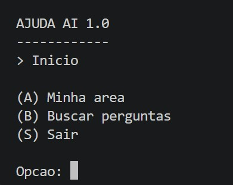
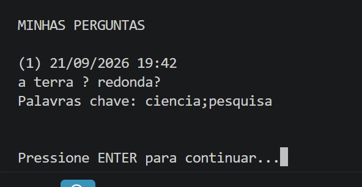

<div align="center">

# Ajuda Aí 1.0

### Trabalho Prático 1 — Relacionamento 1:N

**Algoritmos e Estruturas de Dados III** · Ciência da Computação · PUC Minas — Coração Eucarístico
Prof. Marcos André S. Kutova · 2º semestre de 2026

[**▶ Assistir ao vídeo de demonstração**](https://www.youtube.com/watch?v=j-f7jbeCIKs)

</div>

---

## Participantes

| Nome |
|------|
| Arthur Mendes Lima |
| Gabriel Teodoro Gomes |
| Jean Carlos Lopes Lellis |
| Nicolas Alexandre Torres Dias |

---

## Sumário

1. [Descrição do sistema](#1-descrição-do-sistema)
2. [Como compilar e executar](#2-como-compilar-e-executar)
3. [Arquitetura](#3-arquitetura)
4. [Telas do sistema](#4-telas-do-sistema)
5. [Classes criadas](#5-classes-criadas)
6. [Operações especiais](#6-operações-especiais)
7. [Checklist](#7-checklist)

---

## 1. Descrição do sistema

O **Ajuda Aí 1.0** é um sistema de fórum de perguntas e respostas executado em terminal, que
gerencia o ciclo completo de usuários e perguntas armazenados diretamente em **arquivos
binários**, sem qualquer gerenciador de banco de dados externo. O foco deste primeiro trabalho
é a estruturação e a manipulação do relacionamento **1:N** — um usuário pode criar N perguntas,
mas cada pergunta pertence a um único usuário.

A aplicação é organizada em camadas bem definidas: **visão** (menus em texto), **controle**
(regras de negócio e validações) e **arquivos** (persistência binária com índices diretos e
indiretos).

### Principais recursos

| Recurso | Descrição |
|---|---|
| **Cadastro e login** | Autenticação por e-mail e senha, com armazenamento apenas do hash SHA-256. E-mails são únicos e indexados. |
| **Recuperação de senha** | Por pergunta secreta, com normalização da resposta — insensível a caixa e a acentuação. |
| **Gestão de perguntas** | Inclusão, alteração, listagem e arquivamento, sempre vinculadas a um autor válido por chave estrangeira. |
| **Listagem indexada** | As perguntas de cada usuário são recuperadas por uma Árvore B+, sem varredura sequencial do arquivo. |
| **Integridade dos dados** | Arquivamento lógico das perguntas e exclusão em cascata na remoção de usuários. |

---

## 2. Como compilar e executar

O projeto usa apenas a biblioteca padrão do Java. A partir da pasta `TP1`:

**Git Bash, Linux ou macOS**

```bash
javac -encoding UTF-8 -d bin $(find src -name "*.java")
java -cp bin -Dstdout.encoding=UTF-8 Principal
```

**PowerShell**

```powershell
javac -encoding UTF-8 -d bin (Get-ChildItem -Recurse -Filter *.java src | ForEach-Object { $_.FullName })
java -cp bin "-Dstdout.encoding=UTF-8" Principal
```

**Prompt de comando (CMD)**

```cmd
dir /s /b src\*.java > sources.txt
javac -encoding UTF-8 -d bin @sources.txt
java -cp bin -Dstdout.encoding=UTF-8 Principal
```

Os arquivos de dados são criados automaticamente na pasta `dados/` durante a primeira execução.
Para reiniciar o sistema do zero, basta apagá-la.

---

## 3. Arquitetura

```
TP1/src/
├── Principal.java          ponto de entrada da aplicação
├── view/                   interface textual (somente entrada e saída)
│   ├── Console.java
│   ├── MenuAcesso.java
│   ├── MenuPrincipal.java
│   ├── MenuMinhaArea.java
│   ├── MenuMeusDados.java
│   └── MenuPerguntas.java
├── repository/             camada de controle (regras de negócio)
│   ├── CrudUsuario.java
│   └── CrudPergunta.java
├── files/                  extensões do CRUD genérico, com os índices
│   ├── ArquivoUsuario.java
│   └── ArquivoPergunta.java
├── entities/               entidades serializáveis
│   ├── Usuario.java
│   └── Pergunta.java
├── aed3/                   estruturas fornecidas pelo professor
│   ├── Arquivo.java
│   ├── HashExtensivel.java
│   ├── ArvoreBMais.java
│   └── ...
└── util/
    └── Crypto.java         SHA-256 e normalização de texto
```

### Índices utilizados

| Estrutura | Par chave-valor | Finalidade |
|---|---|---|
| Tabela Hash Extensível | `idEntidade → endereço` | Índice direto, embutido na classe `Arquivo`. Localiza qualquer registro pelo ID. |
| Tabela Hash Extensível | `email → idUsuario` | Índice indireto de chave **exclusiva**, usado no login e na verificação de e-mail duplicado. |
| Árvore B+ | `(idUsuario, idPergunta)` | Índice de chave **não exclusiva**, que materializa o relacionamento 1:N. |

Como camada de controle, os métodos devolvem `null` quando a operação é bem-sucedida e uma
`String` com a mensagem de erro quando alguma regra de negócio a impede. A visão apenas exibe
o resultado.

---

## 4. Telas do sistema

### Login e cadastro


### Menu principal com usuário autenticado


### Listagem de perguntas do usuário


### Pergunta marcada como arquivada


---

## 5. Classes criadas

| Classe | Responsabilidade |
|---|---|
| `Principal` | Ponto de entrada. Instancia `ArquivoUsuario` e `ArquivoPergunta` uma única vez, conecta as referências cruzadas de integridade entre eles, inicia a interface textual e assegura o fechamento dos arquivos no bloco `finally`. |
| `view.Console` | Padroniza a entrada e a saída com uma única instância de `Scanner` sobre `System.in`, evitando a corrupção de buffer que ocorre quando há vários leitores simultâneos. |
| `view.MenuAcesso` | Login, cadastro de novo usuário e fluxo de recuperação de senha pela pergunta secreta. |
| `view.MenuPrincipal` | Roteador principal após a autenticação: minha área, busca de perguntas (prevista para o próximo TP) e encerramento da sessão. |
| `view.MenuMinhaArea` | Acesso à gestão do perfil pessoal e à listagem de perguntas do usuário. |
| `view.MenuMeusDados` | Alteração de nome, e-mail, senha e da pergunta/resposta de recuperação. |
| `view.MenuPerguntas` | Listagem, inclusão, alteração e arquivamento das perguntas do usuário. |
| `repository.CrudUsuario` | Regras de negócio de usuário: validações, unicidade de e-mail, autenticação, alterações e exclusão em cascata. |
| `repository.CrudPergunta` | Regras de negócio de pergunta: verificação de posse, integridade referencial com o arquivo de usuários e arquivamento. |
| `files.ArquivoUsuario` | Especialização de `Arquivo<Usuario>` que acrescenta e mantém sincronizado o índice indireto de e-mails em Tabela Hash Extensível. |
| `files.ArquivoPergunta` | Especialização de `Arquivo<Pergunta>` que acrescenta e mantém sincronizada a Árvore B+ responsável pelo relacionamento 1:N. |
| `util.Crypto` | Cálculo de hash SHA-256 e normalização de strings — remoção de diacríticos e conversão para minúsculas. |

---

## 6. Operações especiais

### Atualização de e-mail e o índice indireto

O e-mail é a **chave** do índice secundário em Hash Extensível, e chave de índice não é editada
no lugar. Quando o e-mail é alterado, o método `update()` grava primeiro os novos dados no
arquivo de dados e, em seguida, remove a entrada antiga do índice com `indiceEmail.delete()` e
insere o novo par com `indiceEmail.create()`, apontando para o **mesmo ID**.

São duas ações, e não uma alteração. Como o `idUsuario` não muda, todos os pares registrados na
Árvore B+ permanecem válidos e nenhuma pergunta precisa ser tocada — é exatamente por isso que
os índices secundários apontam para o ID, que é estável, e não para a posição física, que não é.

### Arquivamento versus exclusão por lápide

São dois mecanismos distintos, em níveis diferentes:

| | Lápide (exclusão lógica) | Arquivamento (`ativa = false`) |
|---|---|---|
| **Nível** | Arquivo | Entidade |
| **O que acontece** | O registro é marcado como excluído, o identificador sai dos índices e o espaço físico entra na lista de espaços livres. | Apenas um atributo booleano do registro muda. |
| **Resultado** | O dado deixa de existir para o sistema. | O registro continua válido, indexado e legível, apenas sinalizado como arquivado. |

As perguntas são **arquivadas, nunca excluídas**, porque possuem dados correlacionados criados
por terceiros — respostas, votos e comentários. Apagá-las destruiria conteúdo alheio. O
arquivamento é definitivo: não existe desarquivar.

### Exclusão em cascata (CASCADE)

Para impedir a existência de perguntas órfãs — perguntas apontando para um autor inexistente —
a remoção de um usuário é executada em cascata. O sistema consulta primeiro a Árvore B+ para
obter todas as perguntas vinculadas ao `idUsuario` e exclui cada uma por completo, do arquivo de
dados e dos índices. Somente após limpar todas as dependências o registro do usuário e a sua
entrada no índice de e-mails são removidos.

A ordem importa: excluir o usuário primeiro deixaria perguntas apontando para um ID que já não
existe.

### Listagem 1:N com coringa na Árvore B+

Para recuperar as perguntas de um usuário sem varrer o arquivo de dados inteiro, o
relacionamento é indexado em uma Árvore B+ de pares `ParIdId(idUsuario, idPergunta)`. A consulta
usa uma chave com coringa, `ParIdId(idUsuario, -1)`: o método `compareTo` ignora o segundo
elemento quando ele vale `-1`, de modo que a árvore devolve, em ordem, todos os pares daquele
autor.

O caminho completo da listagem é:

```
idUsuario
   ↓
Árvore B+ .read(idUsuario, -1)
   ↓
lista de idPergunta
   ↓
índice direto ID → endereço (Hash Extensível)
   ↓
seek(endereço) → lápide + tamanho + bytes
   ↓
deserialize() → objeto Pergunta
```

Assim, o arquivo de dados é acessado apenas nas posições dos registros que realmente interessam.

---

## 7. Checklist

> **Há um CRUD de usuários (que estende a classe Arquivo, acrescentando Tabelas Hash Extensíveis e Árvores B+ como índices diretos e indiretos conforme necessidade) que funciona corretamente?**

**Sim.** `ArquivoUsuario` estende `Arquivo<Usuario>`, herda o índice direto por ID e acrescenta o
índice indireto de e-mail em Tabela Hash Extensível, sobrescrevendo `create`, `update` e `delete`
para mantê-lo sincronizado em inserções, alterações e exclusões.

> **Há um CRUD de perguntas (que estende a classe Arquivo, acrescentando Tabelas Hash Extensíveis e Árvores B+ como índices diretos e indiretos conforme necessidade) que funciona corretamente?**

**Sim.** `ArquivoPergunta` estende `Arquivo<Pergunta>`, herda o índice direto por ID e acrescenta
a Árvore B+ que indexa a associação 1:N, mantida sincronizada nas mesmas operações.

> **As perguntas estão vinculadas aos usuários usando o idUsuario como chave estrangeira?**

**Sim.** O atributo `idUsuario` compõe a entidade `Pergunta`, e sua existência no arquivo de
usuários é confirmada no momento da gravação.

> **Há uma árvore B+ que registre o relacionamento 1:N entre usuários e perguntas?**

**Sim.** Implementada como `ArvoreBMais<ParIdId>`, armazenando o par `(idUsuario, idPergunta)` e
suportando a consulta por coringa descrita na seção 6.

> **O trabalho compila corretamente?**

**Sim.** Compilação executada com `javac` e charset UTF-8, sem erros nem avisos.

> **O trabalho está completo e funcionando sem erros de execução?**

**Sim.** Todos os fluxos exigidos pelo enunciado foram executados e testados.

> **O trabalho é original e não a cópia de um trabalho de outro grupo?**

**Sim.** Desenvolvido integralmente pelos membros do grupo.
